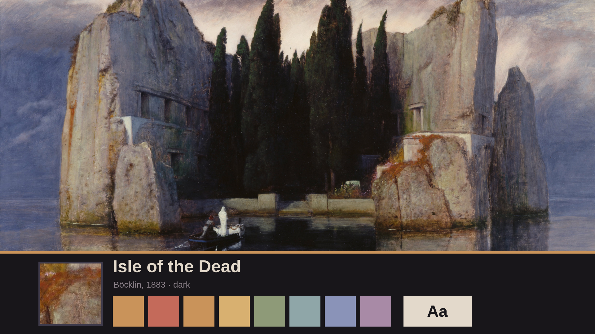
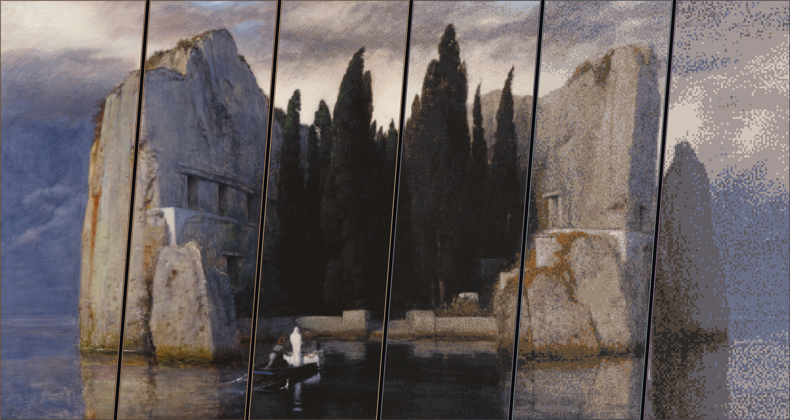
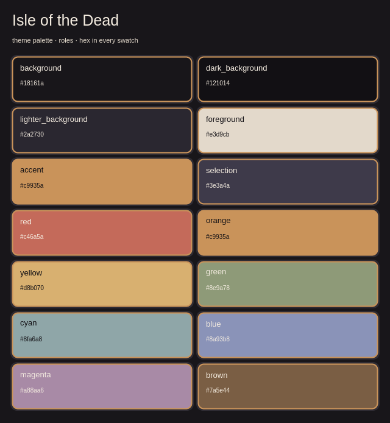

# Isle of the Dead

A dark Omarchy theme from Arnold Böcklin's *Isle of the Dead* (third
version, 1883): cypress-shadow surfaces, the bone-white of the shrouded figure
for text, ochre lichen from the rocks for focus, and the slate storm sky for
information.



## Install

```bash
omarchy theme install https://github.com/benredrew/omarchy-isle-of-the-dead-theme.git
```

Then choose **Isle of the Dead** from Omarchy's theme picker, or run:

```bash
omarchy theme set isle-of-the-dead
```

## Backgrounds

Six ordered treatments of the same painting, shared by every Isle of the Dead
theme, made with `agent-theme-levels --method low-res-speckle --levels 6`:
**A Crisp**, **B Light 20**, **C Light 40**, **D Medium 60**, **E Medium 80**,
and **F Strong**. Each averages the painting into hard-edged pixels that keep
its local color, reduces the colors with half-strength dithering, and adds
light grain; F is drawn only from twelve colors of the painting itself, so it
suits light and dark themes alike. D is the intended look. Omarchy starts on A;
switch with `omarchy theme bg next`.

## Previews

| Wallpaper treatment levels | Palette |
| --- | --- |
|  |  |

## Photo

*Die Toteninsel* (*Isle of the Dead*), third version, 1883, by Arnold Böcklin;
oil on wood, [Alte Nationalgalerie, Staatliche Museen zu Berlin](https://www.smb.museum/en/museums-institutions/alte-nationalgalerie/home/).
The scan, from [Google Arts & Culture](https://artsandculture.google.com/asset/0wFgMTIQ3kZCpg)
via [Wikimedia Commons](https://commons.wikimedia.org/wiki/File:Arnold_B%C3%B6cklin_-_Die_Toteninsel_III_(Alte_Nationalgalerie,_Berlin).jpg),
is used uncropped at 4933×2628 and treated as above; the palette is sampled
from it. The painting is in the public domain: Böcklin died in 1901, and a
faithful reproduction of a public-domain artwork carries no new copyright (§68
UrhG in Germany; *Bridgeman v. Corel* in the US).

## License

[CC0 1.0 Universal](https://creativecommons.org/publicdomain/zero/1.0/): the
theme files, wallpapers and previews are dedicated to the public domain. Use
them for anything, no credit required.
